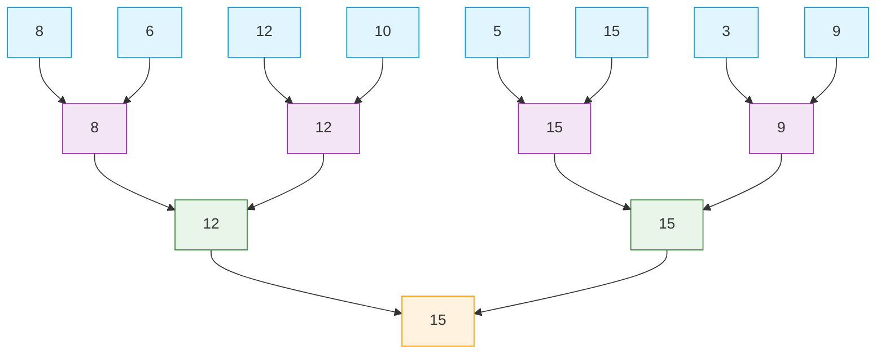

### 核心思想：体育锦标赛

想象一下有 8 位选手（A, B, C, D, E, F, G, H）参加一场单败淘汰制的网球锦标赛。赛制如下：

1. ​**第一轮**​：8位选手两两对决（A vs B, C vs D, E vs F, G vs H）。
    
2. ​**第二轮**​：第一轮的胜者再次两两对决（AB之间的胜者 vs CD之间的胜者，EF之间的胜者 vs GH之间的胜者）。
    
3. ​**决赛**​：第二轮的两位胜者进行决赛，决出最终的冠军。
    

这个赛程表，如果画成一张图，就是一棵**锦标赛树**。最终的冠军就是这8人中的**最大值**。

---

### 锦标赛树的结构

锦标赛树是一棵**完全二叉树**。

- ​**叶子节点**​：树的最后一层节点，代表所有参与比较的原始数据。比如我们的8位选手。
    
- ​**内部节点**​：非叶子节点。每个内部节点代表一场“比赛”的结果，它的值是它两个子节点中的**胜出者**​（最大值或最小值）。
    

下图清晰地展示了寻找最大值（Winners Tree）的锦标赛树结构：

- ​**建树过程**​：从叶子节点开始，两两比较，胜者向上晋级，直到根节点。建树的时间复杂度为 O(n)。
    
- ​**查询最大值**​：由于每一轮的胜者都向上传递，所以**根节点就是全局最大值**。查询操作的时间复杂度是惊人的 ​**O(1)​**​！这是它最核心的优势之一。
    

---

### 关键应用：不止是找一次冠军

如果只是找一次最大值，我们直接遍历一遍数组就行了，时间复杂度也是 O(n)。锦标赛树的强大之处在于它能高效地处理**后续查询**。

​**问题：冠军退役后，谁是第二强的？​**​

在数组中，如果你删除了最大值，再找第二大的，又需要 O(n) 时间。但在锦标赛树中，这个过程高效得多。

1. ​**找出真正的亚军**​：亚军一定在决赛中输给了冠军（15）。但是，季军（12）可能在半决赛就输给了亚军（15），所以他没机会和冠军打决赛。因此，​**亚军并不一定是全局第二**。
    
2. ​**高效的重赛过程**​：
    
    - 将冠军（15）所在的叶子节点值设为 -∞（表示退役）。
        
    - 然后**只重新进行与这个冠军节点相关的比赛**。即，从该叶子节点开始，沿着路径向上，重新和兄弟节点比较。
        
    - 这个过程只需要 O(log n) 的时间，因为树的深度是 log n。
        
    

​**这样，我们就能在 O(log n) 的时间内找到新的冠军（即原来的第二名）。​**​

重复这个过程，就可以按顺序从大到小（或从小到大）输出所有元素，这被称为**淘汰赛排序**。它的时间复杂度是 O(n log n)，和堆排序一样。

---

### 锦标赛树 vs. 堆

锦标赛树和堆（Heap）非常相似，都是完全二叉树，都能高效地找到最大/最小值。但有一些细微差别：

|特性|锦标赛树|最大堆|
|---|---|---|
|​**主要目的**​|高效地**连续**找出最大值（或最小值）|高效地动态维护一个优先队列|
|​**找最大值**​|O(1)|O(1)|
|​**删除最大值**​|O(log n)|O(log n)|
|​**插入新元素**​|​**相对复杂**，通常需要重建部分树|​**简单**，O(log n)|
|​**结构**​|显式地存储了所有比较历史和路径|只维护父子关系，不存储比较历史|

​**简单来说：​**​

- ​**堆**更像一个**动态的优先队列**，支持高效的插入和删除。
    
- ​**锦标赛树**更像一个**静态的淘汰赛记录表**，它完美地记录了整个比较过程，非常适合从静态数据中多次提取极值（比如找出前K个最大/最小的元素），但插入新选手比较麻烦。
    

---

### 总结

1. ​**是什么**​：锦标赛树是一种基于二叉树形锦标赛的数据结构。
    
2. ​**做什么**​：主要用来高效地**查找最大值/最小值**，特别是需要**多次查找**的情况（如找前K个元素）。
    
3. ​**核心优点**​：
    
    - 第一次找到最大值后，后续每次找出“下一个最大值”的成本很低，仅为 ​**O(log n)​**。
        
    - 它清晰地记录了比较路径，容易理解和实现。
        
    
4. ​**典型应用**​：
    
    - 外部排序（如多路归并）。
        
    - 体育赛事中的排位赛。
        
    - 在机器学习中寻找距离最近的点等。
        
    

希望这个解释能帮助你彻底理解锦标赛树！